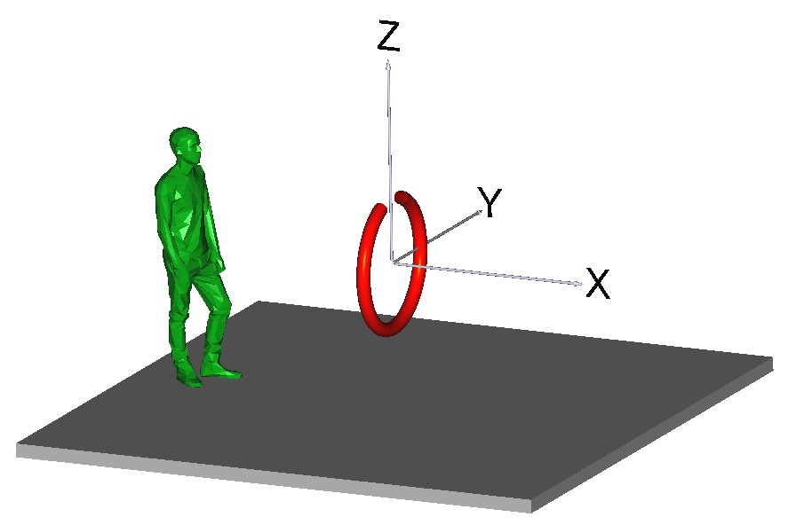
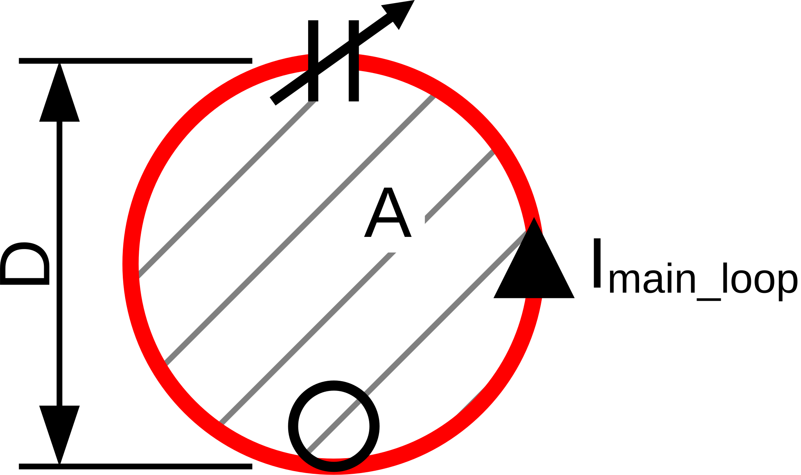

### Magnetic Loop H-Field Calculator

Online Calculator: [petermaerki.github.io/magloop_field](https://petermaerki.github.io/iterativetrimmer)
Repository: [github.com/petermaerki/magloop_field](https://github.com/petermaerki/iterativetrimmer)

	
	
	

		Magnetic loop dipole moment: $m = I_{\text{main loop}} \cdot A$. 
         
        For a circular loop: $m = I_{\text{main loop}} \cdot \pi \left(\frac{D}{2}\right)^2$.
	

